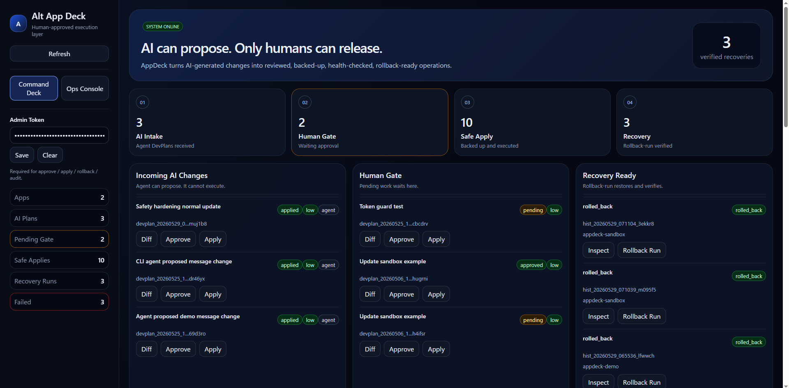
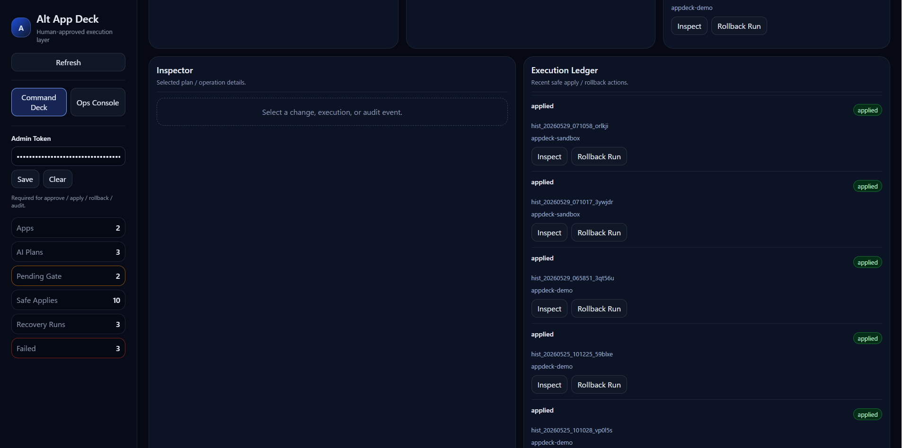
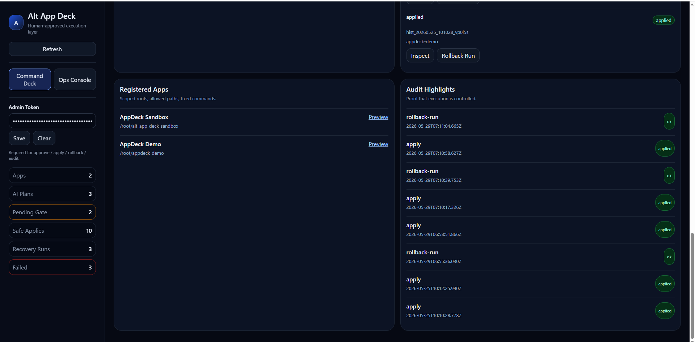

# Alt App Deck

Human-Gated AI Operations Platform
AI生成変更を人間承認つきで安全に流すためのOps Deck

---

## Overview

Alt App Deck is a human-gated control plane for AI-generated application changes.

AI agents can propose DevPlans, but only humans can approve execution.

Alt App Deck then applies the change through a deterministic operational flow:

```text
AI Agent / User
→ DevPlan
→ Diff Preview
→ Human Approval
→ Apply
→ Backup
→ Build
→ Restart
→ Health Check
→ History
→ Rollback Ready
```

Alt App Deckは、AI Agentが生成したアプリ変更をそのまま本番に流さず、
人間承認・Diff確認・Backup・Build・Restart・Health Check・Rollbackに通すための運用レイヤーです。

---

## Status

Public Portfolio Version
Personal Project (2026)

This repository is a sanitized portfolio version.

It does not include:

* production tokens
* private data
* runtime logs
* backups
* live infrastructure configuration
* private Core state

---

## Core Concept

AI can propose.
Only humans can release.

AIは提案できる。
ただし、リリースできるのは人間だけ。

---

## Features

### English

* AI-generated DevPlan intake
* Diff preview before execution
* Human approval gate
* Safe apply pipeline
* Backup before change
* Build / restart / health check flow
* Execution history
* Rollback and rollback-run verification
* Audit logging
* Registered app scope
* Allowed paths / denied paths

### 日本語

* AI生成DevPlanの受け取り
* 実行前のDiff確認
* 人間承認フロー
* 安全なApplyパイプライン
* 変更前Backup
* Build / Restart / Health Check
* 実行履歴管理
* Rollback / Rollback Run
* Audit Log
* 登録アプリ単位の管理
* 許可パス / 拒否パス制御

---

## What It Is

Alt App Deck is a standalone human-approved app operations deck.

It receives DevPlans or fileOps-like instructions from a user or an upstream AI Agent, previews the diff, waits for explicit human approval, then safely applies changes to registered apps.

---

## What It Is Not

Alt App Deck is not Altora Core.

It does not contain private reasoning, memory, persona, Twin, Observer, Fugyaa, Board state, or private Core state.

It is a standalone external operations layer.

---

## Architecture

```text
User / AI Agent
      │
      ▼
DevPlan / fileOps
      │
      ▼
Pending Queue
      │
      ▼
Diff Preview
      │
      ▼
Human Approval
      │
      ▼
Safe Apply
      │
      ▼
Backup
      │
      ▼
Build / Restart / Health Check
      │
      ▼
History / Audit Log
      │
      ▼
Rollback Ready
```

---

## Security Model

Alt App Deck is designed to prevent autonomous AI changes from reaching production without human review.

Main controls:

* Human-gated by default
* Token required for mutating routes
* Agent token can only create pending DevPlans
* Admin token required for approve / apply / rollback / build / restart
* No arbitrary shell execution from DevPlan
* Registered app commands only
* Allowed paths required
* Denied paths enforced
* `.env` and secret files blocked
* Symlink traversal blocked
* File extension allowlist
* File size limit
* Delete requires explicit confirmation
* Backup before apply
* History after apply
* Rollback available

---

## Example DevPlan

```json
{
  "title": "Update demo message",
  "targetAppId": "demo-app",
  "summary": "Update one safe UI text line.",
  "riskLevel": "low",
  "requiresApproval": true,
  "fileOps": [
    {
      "type": "update",
      "path": "/path/to/demo-app/src/message.txt",
      "content": "Updated by AppDeck after human approval.\n",
      "reason": "Demo update"
    }
  ],
  "commands": {
    "build": true,
    "restart": true,
    "healthCheck": true
  }
}
```

---

## Current Implemented Phases

* Phase 1: Sandbox MVP complete
* Phase 2: Real App Onboarding Demo complete
* Phase 3: Token Guard complete
* Phase 4: AI Agent / CLI Adapter complete
* Phase 5-1: UI Admin Token support complete
* Phase 5-2: Rollback-run API complete
* Phase 5-3: Safety hardening complete
* Phase 5-4: Public backend API closed and UI proxy enabled
* Phase 5-5: UI rollback-run complete
* Phase 5-6: UI / audit / product demo polish in progress

---

## Screenshots

### Command Deck



---

### Execution Ledger



---

### Audit / Registered Apps



---

## Tech Stack

* Node.js
* Express
* React
* JavaScript
* Linux VPS
* PM2
* Git / GitHub
* REST API
* Human-in-the-loop workflow design

---

## Project Goals

* Prevent unsafe autonomous AI execution
* Keep humans in the release decision loop
* Make AI-generated changes auditable
* Provide rollback-ready app operations
* Reduce operational uncertainty in AI-assisted development

---

## Product Line

AI-generated changes should not go straight to production.

Alt App Deck gives them a human-approved execution path.

More changes per token.
More control per deploy.

---

## Author

**Shinya Koike**

GitHub:
https://github.com/Shinya266

---

## License

Portfolio / Demonstration Project


## Screenshots

### Command Deck


### Execution Ledger


### Audit / Registered Apps


