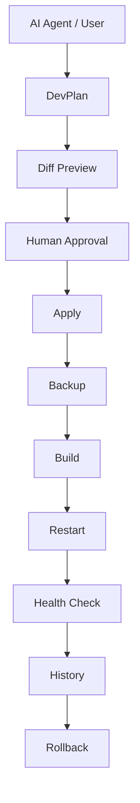

# Alt App Deck

Human-Gated AI Operations Platform for AI-generated application changes.

> Public portfolio version.
> The complete production implementation remains private.

---

# Problem

AI coding tools can generate code quickly, but production operations remain risky.

Common problems include:

- No approval boundary
- Unsafe automatic deployment
- Missing rollback
- Weak audit trails
- Unlimited filesystem access
- Repeated deployment reasoning
- Operational inconsistency

Small teams often need AI-assisted development without giving AI unrestricted production access.

---

# Solution

Alt App Deck introduces a human-approved execution layer.

AI proposes.

Humans approve.

The platform executes changes through a deterministic operational pipeline.

```

---

# System Flow



---

# Screenshots

## Command Deck


---

## Execution Ledger


---

## Audit


---

# Technical Highlights

## Human Approval

AI agents cannot directly deploy changes.

Every mutation requires explicit human approval.

---

## DevPlan

All modifications are represented as structured DevPlans.

Each plan contains:

- target application
- summary
- file operations
- risk level
- build options
- restart options
- health check options

---

## Deterministic Execution

Deployment follows a fixed operational pipeline.

Diff

↓

Backup

↓

Apply

↓

Build

↓

Restart

↓

Health Check

↓

History

↓

Rollback

---

## Rollback-first Design

Rollback is part of the architecture.

Every Apply creates:

- backup
- history
- audit event

Rollback Run performs:

restore

↓

build

↓

restart

↓

health verification

---

## AI Boundary

AI can:

- submit DevPlans

AI cannot:

- approve
- deploy
- rollback
- restart production

---

# Security Model

Main controls:

- Human approval required
- Agent token
- Admin token
- Registered applications only
- Allowed paths
- Denied paths
- Secret-file blocking
- No arbitrary shell execution
- Backup before Apply
- History after Apply
- Rollback support

---

# Example DevPlan

```json
{
  ...
}
```

---

# Current Status

Implemented:

- DevPlan intake
- Approval queue
- Diff preview
- Safe Apply
- Backup
- Build
- Restart
- Health Check
- Audit
- Rollback
- Rollback Run
- UI dashboard
- Agent intake

---

# Repository Scope

Included:

- Architecture
- UI screenshots
- Sample DevPlan
- Security model
- Public documentation

Not included:

- Production infrastructure
- Runtime logs
- Secrets
- Tokens
- Internal implementation
- Live applications

---

# Future Work

Planned:

- Multi-agent orchestration
- Additional deployment adapters
- Kubernetes support
- Approval policy engine
- Deployment analytics

---

# Tech Stack

- Node.js
- Express
- React
- JavaScript
- Linux VPS
- PM2
- REST API
- GitHub

---

# Why This Matters

AI coding is becoming faster.

Safe deployment is becoming more important.

Alt App Deck focuses on the operational boundary between AI-generated code and production systems.

Instead of replacing engineers, it keeps humans responsible for release while automating repeatable operational work.

---

# License

Portfolio Version.
The production implementation remains private.


## Why This Project Is Different

Most AI coding tools focus on code generation.

Alt App Deck focuses on safe execution.

Rather than allowing AI agents to directly mutate production systems, it introduces a human-approved operational boundary with deterministic execution, rollback, and auditability.

It is designed as a practical operations layer for AI-native software development.
